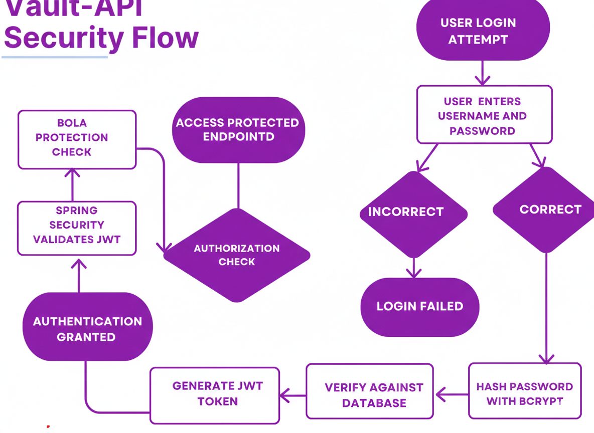

# 🔐 Vault API

A research-backed secure banking backend built with Spring Boot, focusing on authentication, BOLA prevention, and data encryption.

---

## 🎯 Overview

SecureBank API is a backend banking simulation designed to demonstrate modern API security practices including:

- BCrypt password hashing  
- JWT-based stateless authentication  
- BOLA (Broken Object Level Authorization) prevention  
- AES-256 encryption for sensitive financial data  
- Structured exception handling  
- Integration and security testing  

This project bridges cybersecurity research and practical backend implementation.

---

## ✨ Key Features

-  Secure User Registration (BCrypt hashing, cost factor 12)  
- JWT Authentication (HS256, 24-hour expiration)  
- BOLA Protection (users access only their own accounts)  
- Bank Account Management  
- AES-256-GCM Encryption for balances at rest  
- Clean API error responses via GlobalExceptionHandler  
- Unit & Integration Testing (40%+ coverage)  

---

## 🏗️ System Architecture

```
Controller → Service → Repository → Database
JWT Filter → SecurityContext → Protected Endpoints
JPA → Hibernate → MySQL
```

---

## 🔧 Tech Stack

- Java 17  
- Spring Boot 3  
- Spring Security  
- Spring Data JPA  
- MySQL  
- JJWT (HS256)  
- Lombok  
- JUnit + Mockito  

---

## 🔐 Authentication & Security

### Password Security

- BCrypt hashing  
- Salted + adaptive cost factor (12)  

### Authentication

- JWT (HS256 symmetric signing)  
- 24-hour expiration  
- Bearer token format  

### Authorization

- BOLA prevention implemented at service layer  
- Ownership validation before data access  

### Data Protection

- AES-256-GCM encryption for account balances  
- JPA AttributeConverter for transparent encryption/decryption  

---
### Security Flow


## 🚀 Getting Started

### Prerequisites

- Java 17  
- Maven  
- MySQL 8+  

### Setup

```bash
git clone https://github.com/yourusername/SecureBank-API.git
cd SecureBank-API
mvn clean install
mvn spring-boot:run
```

---

## 🔄 API Endpoints

### Auth

```
POST /api/auth/register
POST /api/auth/login
```

### Accounts

```
POST /api/accounts
GET /api/accounts/{id}
GET /api/accounts/my-accounts
```

---

## 📊 Database Schema

**Tables:**

- users  
- bank_accounts  

**Relationships:**

- One User → Many Bank Accounts  

---

## 🧪 Testing

Run:

```bash
mvn test
```

Includes:

- Registration tests  
- JWT validation tests  
- BOLA prevention tests  
- Integration auth flow tests  

---

## 📈 Security Concepts Demonstrated

- Broken Object Level Authorization (OWASP API1)  
- Password Hashing Best Practices  
- Stateless Authentication  
- Encryption at Rest  
- Secure Exception Handling  

---

## 📌 Limitations & Future Improvements

- No refresh tokens  
- No rate limiting  
- No role-based authorization yet  
- Key management not production-grade  
- No monitoring/log aggregation  
