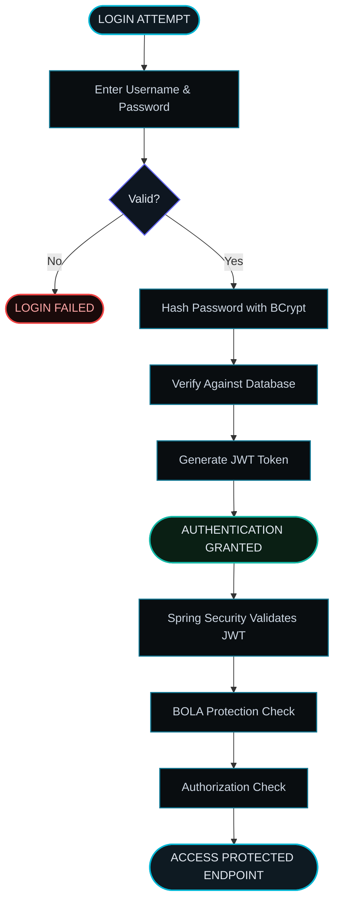
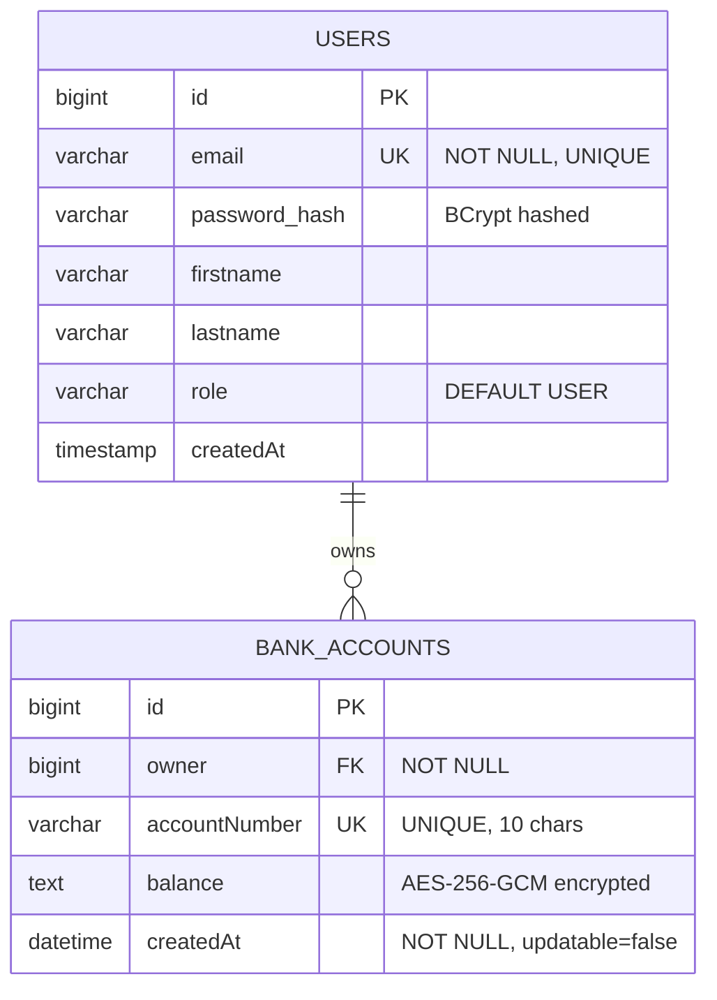

# 🔐 Vault API

A research-backed secure banking backend built with Spring Boot, focusing on authentication, BOLA prevention, and data encryption.

---

## 🎯 Overview

Vault API is a backend banking simulation designed to demonstrate modern API security practices including:

- BCrypt password hashing  
- JWT-based stateless authentication  
- BOLA (Broken Object Level Authorization) prevention  
- AES-256 encryption for sensitive financial data  
- Structured exception handling  
- Integration and security testing  

This project bridges cybersecurity research and practical backend implementation.

---

## ✨ Key Features

-  Secure User Registration (BCrypt hashing, cost factor 12)  
- JWT Authentication (HS256)  
- BOLA Protection (users access only their own accounts)  
- Bank Account Management  
- AES-256-GCM Encryption for balances at rest  
- Clean API error responses via GlobalExceptionHandler  
- Unit & Integration Testing (40%+ coverage)  

---


## 🔧 Tech Stack

- Java 17  
- Spring Boot 3  
- Spring Security  
- Spring Data JPA  
- MySQL  
- JJWT (HS256)  
- Lombok  
- JUnit + Mockito  

---

## 🔐 Authentication & Security

### Password Security

- BCrypt hashing  
- Salted + adaptive cost factor (12)  

### Authentication

- JWT (HS256 symmetric signing)  
- 24-hour expiration  
- Bearer token format  

### Authorization

- BOLA prevention implemented at service layer  
- Ownership validation before data access  

### Data Protection

- AES-256-GCM encryption for account balances  
- JPA AttributeConverter for transparent encryption/decryption  

---
### Security Architecture


```mermaid
flowchart TD
  A(["LOGIN ATTEMPT"]):::start
  B["Enter Username & Password"]:::box
  C{Valid?}:::decision
  D(["LOGIN FAILED"]):::fail
  E["Hash Password with BCrypt"]:::box
  F["Verify Against Database"]:::box
  G["Generate JWT Token"]:::box
  H(["AUTHENTICATION GRANTED"]):::success
  I["Spring Security Validates JWT"]:::box
  J["BOLA Protection Check"]:::box
  K["Authorization Check"]:::box
  L(["ACCESS PROTECTED ENDPOINT"]):::start

  A --> B --> C
  C -->|No| D
  C -->|Yes| E --> F --> G --> H --> I --> J --> K --> L

  classDef start fill:#0e1a22,stroke:#06b6d4,stroke-width:2px,color:#e2e8f0
  classDef box fill:#090d10,stroke:#0e7490,stroke-width:1.5px,color:#cbd5e1
  classDef decision fill:#0e1620,stroke:#6366f1,stroke-width:1.5px,color:#e2e8f0
  classDef success fill:#0a1f14,stroke:#14b8a6,stroke-width:2px,color:#e2e8f0
  classDef fail fill:#1a0a0a,stroke:#ef4444,stroke-width:2px,color:#fca5a5
```

## 🚀 Getting Started

### Prerequisites

- Java 17  
- Maven  
- MySQL 8+ (or Docker for containerised setup)  

### Setup

```bash
git clone https://github.com/Divinekk/Vault-API.git
cd Vault-API
```

**Option A — Docker (recommended)**
```bash
# Spins up MySQL in a container via Docker Compose — no manual MySQL install needed
docker compose up -d
mvn spring-boot:run
```

**Option B — Manual MySQL**
```bash
# Create your MySQL database, configure credentials in application.yml, then:
mvn clean install
mvn spring-boot:run
```

---

## 🔄 API Endpoints

### Auth

```
POST /api/auth/register
POST /api/auth/login
```

### Accounts

```
POST /api/accounts
GET /api/accounts/{id}
GET /api/accounts/my-accounts
```

---

## 📊 Database Schema

```mermaid
erDiagram
    USERS ||--o{ BANK_ACCOUNTS : owns
    
    USERS {
        bigint id PK
        varchar email UK "NOT NULL, UNIQUE"
        varchar password_hash "BCrypt hashed"
        varchar firstname
        varchar lastname
        varchar role "DEFAULT USER"
        timestamp createdAt
    }
    
    BANK_ACCOUNTS {
        bigint id PK
        bigint owner FK "NOT NULL"
        varchar accountNumber UK "UNIQUE, 10 chars"
        text balance "AES-256-GCM encrypted"
        datetime createdAt "NOT NULL, updatable=false"
    }
```

### Field Details

**BankAccount Fields:**
- `id` - Auto-generated primary key (MySQL AUTO_INCREMENT)
- `user_id` - Foreign key to users table (created by @JoinColumn)
- `account_number` - 10-character unique identifier (VARCHAR(10))
- `balance` - AES-256-GCM encrypted BigDecimal stored as TEXT
- `created_at` - Account creation timestamp (immutable)

### Key Design Decisions

**ManyToOne Relationship:**
- One user can have multiple bank accounts (savings, checking, etc.)
- Lazy loading prevents unnecessary user data fetches
- Foreign key: `user_id` references `users(id)`

**Encryption:**
- Balance encrypted using `@Convert(converter = BalanceEncryptor.class)`
- Stored as TEXT (encrypted bytes converted to Base64)
- Automatically encrypted on save, decrypted on load
- Even with database breach, balances remain secure

**BigDecimal for Money:**
- Exact decimal arithmetic (no floating-point errors)
- Essential for financial accuracy
- Prevents rounding issues that cause real money loss

**Constraints:**
- Unique account numbers (no duplicates)
- NOT NULL on critical fields (user_id, balance, created_at)
- `updatable = false` on created_at (immutable timestamp)

### Key Design Decisions

**Security:**
- Passwords stored as BCrypt hashes (cost factor 12)
- Account balances encrypted using AES-256-GCM
- Encrypted data stored as VARBINARY (not VARCHAR)

**Data Integrity:**
- Foreign key constraint: `owner_id` references `users(id)`
- CASCADE DELETE: Deleting user removes their accounts
- Unique constraints on email and account_number

**Performance:**
- Index on `users.email` for fast authentication lookups
- Index on `bank_accounts.owner_id` for account queries

---
## 🧪 Testing

Run:

```bash
mvn test
```

Includes:

- Registration tests  
- JWT validation tests  
- BOLA prevention tests  
- Integration auth flow tests  

---

## 📈 Security Concepts Demonstrated

- Broken Object Level Authorization (OWASP API1)  
- Password Hashing Best Practices  
- Stateless Authentication  
- Encryption at Rest  
- Secure Exception Handling  

---

## 📌 Limitations & Future Improvements

- No refresh tokens  
- No rate limiting  
- No role-based authorization yet  
- Key management not production-grade  
- No monitoring/log aggregation
